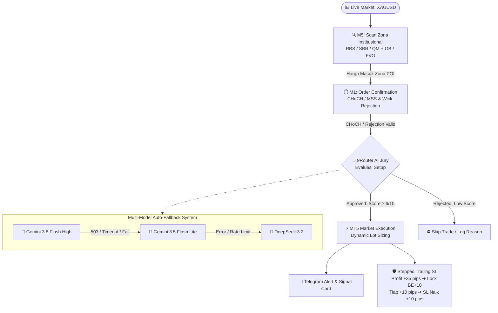

<div align="center">

# 🦅 XAUUSD Shinciro POI/AOI + 9Router AI
### Full Autonomous Hybrid Quantitative Trading Bot for MetaTrader 5

[](https://python.org)
[](https://www.metatrader5.com)
[](http://127.0.0.1:20128)
[](https://telegram.org)
[-FFD700?style=for-the-badge&logoColor=black)](#)
[](#)

<p align="center">
  <b>Bot trading emas (XAUUSD) otomatis berbasis Price Action Shinciro & Smart Money Concepts (SMC).</b><br>
  Dipadukan dengan dewan juri AI Multi-Model (Auto-Fallback), eksekusi ultra-cepat MT5, lot dinamis, dan Stepped Trailing SL pengunci profit otomatis.
</p>

[Fitur Utama](#-fitur-utama) •
[Alur Kerja](#-alur-kerja-sistem-workflow) •
[Strategi Shinciro](#-strategi-trading-shinciro-poiaoi--oc) •
[Dewan Juri AI](#-sistem-ai-auto-fallback-9router) •
[Manajemen Risiko](#-manajemen-risiko--stepped-trailing-sl) •
[Remote Telegram](#-remote-control--notifikasi-telegram) •
[Panduan Instalasi](#-panduan-instalasi--penggunaan)

---

</div>

## 📑 Daftar Isi

- [✨ Fitur Utama](#-fitur-utama)
- [🏗️ Alur Kerja Sistem (Workflow)](#-alur-kerja-sistem-workflow)
- [🎯 Strategi Trading: Shinciro POI/AOI + OC](#-strategi-trading-shinciro-poiaoi--oc)
  - [1. Higher Timeframe (M5) — POI & AOI Mapping](#1-higher-timeframe-m5--pemetaan-poi--aoi)
  - [2. Lower Timeframe (M1) — Order Confirmation](#2-lower-timeframe-m1--order-confirmation-oc)
- [🤖 Sistem AI Auto-Fallback (9Router)](#-sistem-ai-auto-fallback-9router)
- [🛡️ Manajemen Risiko & Stepped Trailing SL](#-manajemen-risiko--stepped-trailing-sl)
- [📱 Remote Control & Notifikasi Telegram](#-remote-control--notifikasi-telegram)
- [🚀 Panduan Instalasi & Penggunaan](#-panduan-instalasi--penggunaan)
- [⚙️ Tabel Parameter Konfigurasi](#-tabel-parameter-konfigurasi)
- [📂 Struktur Direktori Proyek](#-struktur-direktori-proyek)
- [❓ FAQ & Troubleshooting](#-faq--troubleshooting)
- [⚖️ Disclaimer & Peringatan Risiko](#-disclaimer--peringatan-risiko)

---

## ✨ Fitur Utama

| Fitur | Keterangan |
| :--- | :--- |
| **🏛️ Dual-Timeframe SMC Engine** | Mapping area institusional pada **M5** (RBS, SBR, QM, OB, FVG) dan trigger eksekusi presisi pada **M1** (CHoCH / Pinbar). |
| **🤖 9Router Multi-Model Auto-Fallback** | Setup divalidasi oleh dewan juri LLM (`Gemini 3.8 Flash High` ➔ `Gemini 3.5 Flash Lite` ➔ `DeepSeek 3.2`) anti-down / rate-limit. |
| **🛡️ Stepped Trailing SL (+35 ➔ BE+10)** | Profit +35 pips langsung mengunci SL di BE+10 pips (*Risk-Free*), lalu trailing bertahap tiap kenaikan +10 pips. |
| **💰 Dynamic Lot Sizing & Circuit Breaker** | Lot dihitung presisi berdasarkan toleransi risiko % saldo akun dengan rem darurat *Daily Loss Limit* (3%). |
| **📱 Full Telegram Control (Pure HTTP)** | Kontrol bot jarak jauh (`/status`, `/close`, `/report`, `/pause`, `/resume`) menggunakan zero-conflict HTTP API. |
| **⚡ Native MT5 Windows Integration** | Eksekusi pasar cepat bertipe `ORDER_FILLING_IOC` dengan slippage & magic number handler bawaan. |

---

## 🏗️ Alur Kerja Sistem (Workflow)



---

## 🎯 Strategi Trading: Shinciro POI/AOI + OC

Bot mengadopsi metodologi **Shinciro Price Action** yang menggabungkan struktur pasar fraktal, likuiditas, dan ketidakseimbangan harga.

### 1. Higher Timeframe (M5) — Pemetaan POI & AOI

Pada timeframe M5, bot memetakan level kunci di mana institusi besar meninggalkan jejak volume:

* **Point of Interest (POI):**
  * **RBS (Resistance Become Support):** Area resisten swing yang ditembus secara impulsif ke atas. Ketika harga kembali melakukan retest, area ini menjadi lantai pijakan kuat untuk peluang **BUY**.
  * **SBR (Support Become Resistance):** Area support swing yang dijebol ke bawah. Saat harga pull-back kembali, area ini menjadi atap pantulan untuk peluang **SELL**.
  * **Quasimodo Pattern (QM):**
    * *Bearish QM:* Pola manipulasi `High ➔ Low ➔ Higher High (HH) ➔ Lower Low (LL)`. Entry **SELL** presisi di area *Left Shoulder*.
    * *Bullish QM:* Pola manipulasi `Low ➔ High ➔ Lower Low (LL) ➔ Higher High (HH)`. Entry **BUY** presisi di area *Left Shoulder*.

* **Area of Interest (AOI Confluence):**
  * **OB (Order Block):** Candle berlawanan arah terakhir sebelum terjadinya lonjakan harga besar. Menjadi filter konfirmasi tambahan di zona POI.
  * **FVG (Fair Value Gap):** Ketidakseimbangan (imbalance) 3 candle yang berfungsi sebagai magnet likuiditas sebelum harga melanjutkan arah tren.

> [!TIP]
> Jika setup POI bertepatan dengan AOI (OB atau FVG), tingkat kepercayaan awal (*confidence*) otomatis ditingkatkan ke level maksimal.

---

### 2. Lower Timeframe (M1) — Order Confirmation (OC)

Bot **tidak pernah melakukan limit order buta**. Saat harga menyentuh zona M5, bot beralih ke timeframe M1 untuk memastikan *Smart Money* sudah mulai membalikkan harga:

```
                      BULLISH CHoCH (M1)
                              ▲
                             / \      [Break Swing High]
                      /\    /   \   ───► ENTRY BUY
                     /  \  /     \
                    /    \/
                   /   [Swing High]
       ───────────▼────────────────────────── Zona POI (M5)
```

1. **CHoCH (Change of Character / Market Structure Shift):**
   * **BUY:** Candle M1 ditutup menembus (*close above*) swing high lokal 7 candle terakhir.
   * **SELL:** Candle M1 ditutup menembus (*close below*) swing low lokal 7 candle terakhir.
2. **Rejection Pinbar:**
   * Candle pembalikan dengan ekor panjang penolakan zona (`panjang ekor >= 1.3x ukuran body candle`).

---

## 🤖 Sistem AI Auto-Fallback (9Router)

Sebelum order dikirim ke MT5, bot berkonsultasi dengan LLM via **9Router Proxy** untuk menilai konteks pasar, kejenuhan harga, dan rasio risiko.

```
       [Sinyal Masuk]
             │
             ▼
    ┌─────────────────────────────────┐
    │ 🥇 ag/gemini-3.8-flash-high     │ ───► Sukses ➔ Evaluasi Skor
    └─────────────────────────────────┘
             │ (Timeout / 503 / Limit)
             ▼
    ┌─────────────────────────────────┐
    │ 🥈 gemini/gemini-3.5-flash-lite │ ───► Sukses ➔ Evaluasi Skor
    └─────────────────────────────────┘
             │ (Timeout / Error)
             ▼
    ┌─────────────────────────────────┐
    │ 🥉 kr/deepseek-3.2              │ ───► Sukses ➔ Evaluasi Skor
    └─────────────────────────────────┘
```

### Standar Evaluasi AI (JSON Output)
AI merespons strictly dalam format terstruktur:
```json
{
  "valid": true,
  "confidence": 8,
  "reason": "Valid liquidity sweep on M5 RBS zone with clean M1 bullish displacement"
}
```
* **Threshold Eksekusi:** Hanya sinyal dengan `valid = true` dan skor `confidence >= 6/10` yang akan dieksekusi.
* **Auto-Fallback Keandalan:** Jika model utama mengalami kendala jaringan atau server busy, request langsung diteruskan ke model cadangan dalam hitungan milidetik tanpa interupsi.

---

## 🛡️ Manajemen Risiko & Stepped Trailing SL

Pertahanan modal adalah prioritas nomor satu. Bot dilengkapi kalkulator risiko multi-lapis:

### 1. Dynamic Lot Calculation
Lot dihitung otomatis berdasarkan persentase risiko akun:
$$\text{Lot} = \frac{\text{Balance} \times \text{Risk \%}}{\text{SL Distance (Points)} \times \text{Tick Value}}$$

### 2. Stepped Trailing Stop-Loss
Mekanisme trailing bertingkat untuk memastikan profit tidak berubah menjadi rugi:

```
[Entry: 4290.00] ───► [+35 pips] ───► SL geser ke BE + 10 pips (4291.00) [Risk-Free Locked]
                      [+45 pips] ───► SL naik ke BE + 20 pips (4292.00)
                      [+55 pips] ───► SL naik ke BE + 30 pips (4293.00)
                      ...dan seterusnya (+10 pips tiap kelipatan profit)
```

### 3. Circuit Breaker Harian
Jika akumulasi kerugian dalam 1 hari menyentuh `MAX_DAILY_LOSS_PCT` (default: **3%**), bot langsung menghentikan pembukaan posisi baru untuk melindungi akun dari badai pasar.

---

## 📱 Remote Control & Notifikasi Telegram

Bot beroperasi mandiri namun tetap berada di bawah kendali penuh Anda melalui Telegram.

### 🔔 Tampilan Notifikasi Sinyal & Trailing

```
🎯 SHINCIRO POI & OC [🟢 BUY]
━━━━━━━━━━━━━━━━
📊 Symbol : XAUUSD-VIP | M5/M1
🏛 POI    : RBS
⚡ OC (M1): CHoCH_BULL
⭐ Score  : 8/10
━━━━━━━━━━━━━━━━
💵 Entry  : 4292.15
🛑 SL     : 4280.86
🎯 TP     : 4314.73
━━━━━━━━━━━━━━━━
POI=RBS | AOI=Bullish_OB | OC=CHoCH_BULL
💡 AI: Approved (8/10 via gemini-3.8-flash-high): Valid liquidity sweep
🕐 00:04:31
```

```
📈 TRAILING SL NAIK (+10 pip)
━━━━━━━━━━━━━━━━
🎫 Ticket : #28472910 [BUY]
💹 Profit : +45.2 pip
🛡 SL Baru: 4292.15 (BE+20 pip)
🕐 00:15:20
```

### 🎮 Daftar Perintah Remote

| Perintah | Deskripsi |
| :--- | :--- |
| `/status` | Melihat saldo, ekuitas, P&L hari ini, dan seluruh posisi aktif beserta profit berjalannya. |
| `/report` | Menampilkan rekapitulasi performa trading 7 hari terakhir (Win Rate, Total Trade, Net Profit). |
| `/close` | **Emergency Switch:** Menutup paksa seluruh posisi yang terbuka secara seketika. |
| `/pause` | Menghentikan sementara bot membuka posisi baru. |
| `/resume` | Mengaktifkan kembali bot untuk mencari peluang setup. |
| `/help` | Menampilkan panduan bantuan perintah. |

---

## 🚀 Panduan Instalasi & Penggunaan

### 1. Prasyarat Sistem
- **Sistem Operasi:** Windows 10/11 atau Windows Server (diperlukan oleh MetaTrader 5 Terminal).
- **Python:** Versi 3.10 atau lebih baru.
- **Akun Broker:** MetaTrader 5 yang mendukung instrumen XAUUSD/Gold.
- **Akun Telegram:** Bot Token dari [@BotFather](https://t.me/BotFather) dan Chat ID dari [@userinfobot](https://t.me/userinfobot).

### 2. Clone Repositori & Persiapan Lingkungan

Buka Terminal / PowerShell:
```bash
# Clone repository
git clone https://github.com/jhon7z/tradingbyai.git
cd tradingbyai

# Buat virtual environment (Disarankan)
python -m venv venv
venv\Scripts\activate

# Install dependensi
pip install -r requirements.txt
```

### 3. Konfigurasi MetaTrader 5
1. Buka aplikasi **MetaTrader 5**.
2. Masuk ke menu **Tools** ➔ **Options** ➔ tab **Expert Advisors**.
3. Pastikan opsi berikut dicentang:
   - ✅ **Allow automated trading**
   - ✅ **Allow DLL imports**
4. Login ke akun trading Anda di MT5.

### 4. Pengaturan File `config.py`
Buka file `config.py` dan sesuaikan parameter akun Anda:

```python
# MT5 Credentials
MT5_LOGIN    = 123456789             # Nomor akun MT5
MT5_PASSWORD = "your_password"       # Password akun MT5
MT5_SERVER   = "YourBroker-Server"   # Nama server broker

# Telegram Credentials
TELEGRAM_TOKEN   = "123456:ABC-DEF..." # Token dari @BotFather
TELEGRAM_CHAT_ID = "987654321"         # Chat ID Anda

# 9Router AI Multi-Model Config
ROUTER_BASE_URL   = "http://127.0.0.1:20128/v1"
ROUTER_API_KEY    = "sk-your-key"
ROUTER_MODELS     = [
    "ag/gemini-3.8-flash-high",
    "gemini/gemini-3.5-flash-lite",
    "kr/deepseek-3.2"
]
USE_AI_VALIDATION = True

# Simbol Pair Sesuai Broker
SYMBOL = "XAUUSD-VIP"  # Ganti dengan simbol gold di broker Anda (cth: XAUUSD, GOLD, XAUUSDm)
```

### 5. Menjalankan Bot
Jalankan bot melalui terminal:
```bash
python main.py
```
Saat bot aktif, Anda akan menerima pesan sambutan di Telegram beserta saldo akun dan log scanner live di konsol.

---

## ⚙️ Tabel Parameter Konfigurasi

Semua parameter dapat diatur di file `config.py`:

| Parameter | Default | Keterangan |
| :--- | :--- | :--- |
| `SYMBOL` | `"XAUUSD-VIP"` | Simbol pair yang ditradingkan pada MT5. |
| `TIMEFRAME_MAIN` | `M5` | Timeframe analisa struktur POI & AOI. |
| `TIMEFRAME_ENTRY` | `M1` | Timeframe konfirmasi order (CHoCH/Pinbar). |
| `MAX_RISK_PERCENT` | `1.0` | Persentase risiko maksimal dari balance per trade. |
| `RR_RATIO` | `2.0` | Rasio Risk-to-Reward minimum (1:2). |
| `SL_BUFFER_POINTS` | `30` | Buffer tambahan SL di luar swing (3 pips / 30 points). |
| `TRIGGER_PIPS` | `35` | Profit berjalan untuk aktivasi pertama Trailing SL. |
| `FIRST_BE` | `10` | Jarak kunci profit pertama di atas/bawah entry (+10 pips). |
| `STEP_PIPS` | `10` | Jarak kenaikan berkala untuk trailing berikutnya (+10 pips). |
| `MAX_DAILY_LOSS_PCT`| `3.0` | Batas rem darurat kerugian harian sebelum bot berhenti. |
| `MAX_OPEN_TRADES` | `3` | Jumlah maksimal posisi terbuka secara bersamaan. |
| `SIGNAL_COOLDOWN_SEC`| `180` | Waktu jeda (detik) antar sinyal pada zona yang sama. |
| `CHECK_INTERVAL_SEC` | `10` | Interval loop pemindaian market (detik). |
| `SESSION_START_HOUR` | `2` | Jam mulai sesi trading (UTC). 02:00 UTC = 09:00 WIB. |
| `SESSION_END_HOUR` | `21` | Jam selesai sesi trading (UTC). 21:00 UTC = 04:00 WIB. |

---

## 📂 Struktur Direktori Proyek

```
tradingbyai/
├── config.py              # Konfigurasi credentials, pair, model AI, dan parameter bot
├── strategy.py            # Logika Shinciro POI (RBS/SBR/QM) & M1 Confirmation (CHoCH/Rejection)
├── mt5_handler.py         # Penghubung MT5, eksekusi order, pembacaan tick, dan trailing SL
├── telegram_handler.py    # Notifikasi & polling perintah via HTTP request (Zero library clash)
├── risk_manager.py        # Kalkulasi lot dinamis, validasi jarak SL/TP, & daily circuit breaker
├── logger.py              # Sistem logging konsol & arsip file harian (logs/bot_YYYYMMDD.log)
├── main.py                # Main loop scanner pasar, 9Router AI fallback, & trade manager
├── update_github.py       # Skrip utilitas push otomatis ke GitHub repository
├── requirements.txt       # Dependensi Python yang dibutuhkan
└── README.md              # Dokumentasi lengkap proyek
```

---

## ❓ FAQ & Troubleshooting

<details>
<summary><b>1. Kenapa muncul pesan error "Order gagal retcode=10027"?</b></summary>
Error ini berarti <b>AutoTrading belum diaktifkan</b> di MetaTrader 5 Anda. Pastikan tombol <b>Algo Trading</b> di toolbar MT5 berwarna hijau, dan opsi <i>Allow automated trading</i> di menu <code>Tools ➔ Options ➔ Expert Advisors</code> sudah dicentang.
</details>

<details>
<summary><b>2. Mengapa tidak ada posisi yang terbuka meskipun harga sudah masuk zona?</b></summary>
Bot mewajibkan adanya <b>Order Confirmation (OC) di M1</b> (CHoCH atau Rejection Pinbar) dan persetujuan dari <b>9Router AI</b> (skor ≥ 6). Jika salah satu syarat belum terpenuhi, bot sengaja tidak entry demi menghindari false breakout / jebakan likuiditas.
</details>

<details>
<summary><b>3. Simbol tidak ditemukan / Tidak bisa ambil data tick?</b></summary>
Periksa kembali penamaan simbol pada broker Anda di <code>config.py</code>. Beberapa broker menggunakan akhiran seperti <code>XAUUSD</code>, <code>XAUUSD.m</code>, <code>GOLD</code>, atau <code>XAUUSD-VIP</code>.
</details>

---

## ⚖️ Disclaimer & Peringatan Risiko

> [!CAUTION]
> **PERINGATAN RISIKO TINGGI:** Perdagangan instrumen keuangan leverage seperti Emas (XAUUSD) mengandung tingkat risiko yang sangat signifikan terhadap modal Anda dan tidak cocok untuk semua investor. Bot ini dikembangkan sebagai alat bantu komputasi kuantitatif dan analisis algoritmik. Kinerja masa lalu tidak menjamin hasil di masa mendatang. Pengembang tidak bertanggung jawab atas segala kerugian finansial yang diakibatkan oleh penggunaan perangkat lunak ini. **Sangat disarankan untuk menguji bot secara komprehensif pada Akun Demo sebelum menggunakannya pada akun riil.**

---

<div align="center">
  <sub>Dibuat dengan ❤️ untuk komunitas trader kuantitatif & algoritma.</sub><br>
  <sub>© 2026 XAUUSD Shinciro AI Project. All rights reserved.</sub>
</div>